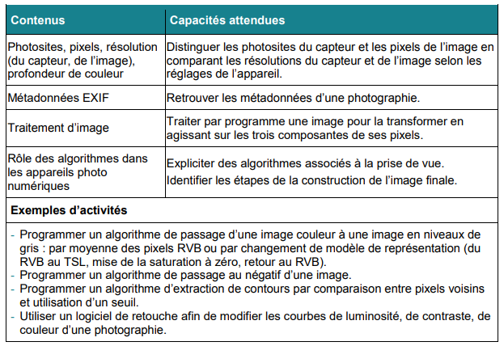

# SNT
Cours de SNT et répertoires des TPs.

# Liste des TP

## La photographie numérique

[Première séance](Cours_TPs/Premi%C3%A8re%20s%C3%A9ance%202609d189413580e3bd3de86702321f4b.md)

[Photographie numérique](Cours_TPs/Photographie%numérique.md)

 [installez la bibliothèque `Pillow`.](https://snt.ababsurdo.fr/tutoriels/installer-un-paquet-python-avec-thonny/)

[Internet](Cours_TPs/Internet%2028c9d1894135807db38ae83ea26a9345.md)

[**Les données structurées et leur traitement**](Cours_TPs/Les%20donn%C3%A9es%20structur%C3%A9es%20et%20leur%20traitement%202df9d189413580e7983efee4556a06a0.md)

https://snt.erwandemerville.fr/web/securite/

[Web](Cours_TPs/Web%203169d189413580ab99b0ef744b15a5d1.md)

[Réseaux sociaux](Cours_TPs/R%C3%A9seaux%20sociaux%202e59d189413580e2a5d7e7d58ccbac30.md)

[IA](Cours_TPs/IA%203739d189413580bf8085c54f67f7ecf8.md)

[Kahoot SNT – Bilan de l'année](Cours_TPs/Kahoot%20SNT%20%E2%80%93%20Bilan%20de%20l'ann%C3%A9e%203799d189413580b3b5b0dd8d47e5b143.md)
